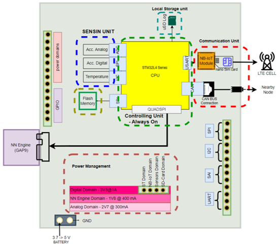

# Tiny_Detector
PCB-design - Firmware design of an intelligent vibration-based SHM node. 

This repo contains hardware and software design of the Tiny-Detector ( a vibration-based node for SHM applications).  

In the first phase of our design, we focused on the PCB design and Manufacturing of the following block diagram. It is composed of 6 different sections: 
* [Power Management Unit]()
* [Digtal Sensing Unit]() 
* [Controlling unit]() 
* [NN engine] 
* Local storage Unit 
* Communication Unit

